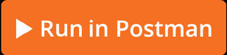
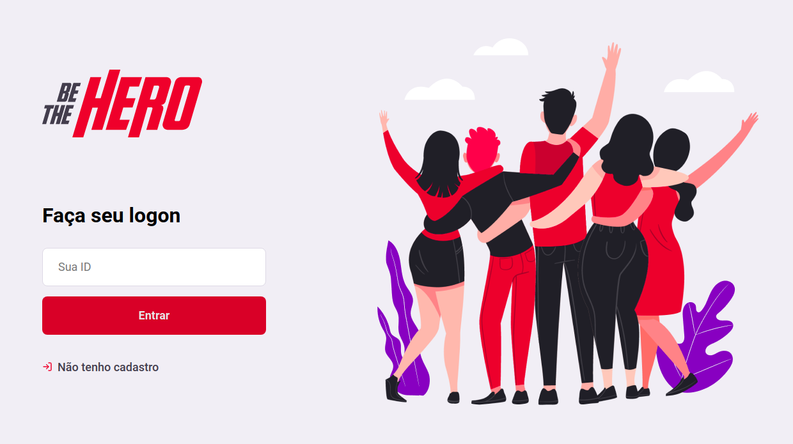

<h1 align="center">
    
</h1>

<h4 align="center"> 
	:construction: 🚀 Semana OmniStack 11.0 In progress.. :construction:
</h4>

  
	
  

  

  

  

  

  <a href="#rocket-Tecnologias">Tecnologias</a>&nbsp;&nbsp;&nbsp;|&nbsp;&nbsp;&nbsp;
  <a href="#-projeto">Projeto</a>&nbsp;&nbsp;&nbsp;|&nbsp;&nbsp;&nbsp;
  <a href="#memo-Licença">Licença</a>

 

## :rocket: Tecnologias

Este projeto foi desenvolvido com as seguintes tecnologias:

- [Node.js](https://nodejs.org/en/) 
- [React](https://reactjs.org)
- [React Native](https://facebook.github.io/react-native/) in coming :construction:
- [Expo](https://expo.io/) in coming :construction:

## 💻 Projeto

Be The Hero é um projeto que visa conectar as pessoas que tem intenção de colaborar para as ONG's.

<h1 align="center">
    
</h1>

## :memo: Licença

Este projeto está sob a licença MIT. Para mais detalhes: [LICENSE](LICENSE.md).

---

Feito com ♥ por Gustavo Melo :wave: [Get in touch!](https://www.linkedin.com/in/g-melo/)
